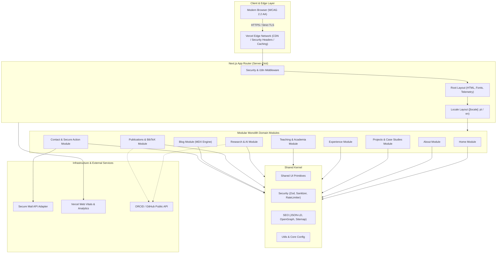

# alexsanderfarias.dev - Plataforma Profissional & Hub Acadêmico

> **Produção:** [https://alexsanderfarias.dev](https://alexsanderfarias.dev)  
> **Autor:** Alexsander Farias (Software Engineer · Professor · Researcher · Systems Architect)  
> **Arquitetura:** Modular Monolith orientado a domínios sobre Next.js App Router & Vercel Edge Network  
> **Filosofia:** Spec-Driven Development (SDD) & Security by Design (OWASP Top 10)

---

## 1. Visão Geral
O **alexsanderfarias.dev** é uma plataforma digital de engenharia de software de alta performance, projetada para consolidar a autoridade técnica e acadêmica de Alexsander Farias sob seis pilares fundamentais:

$$\text{AUTORIDADE} + \text{ENGENHARIA} + \text{TECNOLOGIA} + \text{PESQUISA} + \text{EDUCAÇÃO} + \text{INOVAÇÃO}$$

Diferente de landing pages convencionais e templates estáticos, este projeto é um artefato vivo de Engenharia de Software, implementando arquitetura modular limpa, tipagem estrita end-to-end, testes automatizados, acessibilidade plena (WCAG 2.2 AA) e cabeçalhos defensivos de segurança.

---

## 2. Arquitetura do Sistema (Modular Monolith)

A aplicação adota o padrão **Modular Monolith** para garantir zero overhead de microsserviços e máximo desacoplamento de domínios com contratos públicos estritos.



---

## 3. Stack Tecnológica
- **Framework Core:** [Next.js](https://nextjs.org/) (App Router, Server-First React Server Components)
- **Biblioteca de Interface:** [React](https://react.dev/)
- **Tipagem Estática:** [TypeScript](https://www.typescriptlang.org/) em modo estrito (`strict: true`, zero `any`)
- **Estilização & Design Tokens:** [Tailwind CSS](https://tailwindcss.com/) com paleta *Dark Premium Academic Engineering*
- **Animações & Gestos:** [Motion](https://motion.dev/) (com respeito estrito a `prefers-reduced-motion`)
- **Validação de Schemas:** [Zod](https://zod.dev/)
- **Ícones:** [Lucide React](https://lucide.dev/)
- **Testes Automatizados:** [Vitest](https://vitest.dev/) & [Testing Library](https://testing-library.com/)
- **Gerenciador de Pacotes:** [pnpm](https://pnpm.io/)
- **Hospedagem & CDN:** [Vercel Edge Network](https://vercel.com/)

---

## 4. Estrutura do Repositório

```
alexsanderfarias.dev/
 ├── docs/                             # Especificação Formal SDD
 │    ├── product/                     # Visão de Produto, Personas e Jornadas
 │    ├── specs/                       # Requisitos FR, NFR e Critérios de Aceitação
 │    ├── architecture/                # Arquitetura, Mapa de Módulos e Regras
 │    ├── adr/                         # Architecture Decision Records (ADR-001 a 010)
 │    ├── security/                    # STRIDE Threat Model e Checklists
 │    ├── ux/                          # Design System e Diretrizes de Acessibilidade
 │    ├── testing/                     # Estratégia de Testes em Pirâmide
 │    └── deployment/                  # CI/CD e Especificação Vercel
 │
 ├── src/
 │    ├── app/                         # Next.js App Router (Rotas, Layouts, Middleware)
 │    │    ├── [locale]/               # Sub-caminhos pt e en
 │    │    ├── globals.css             # Design Tokens e Acessibilidade WCAG
 │    │    ├── layout.tsx              # Root Layout e Otimização de Fontes
 │    │    ├── robots.ts               # Diretivas do robots.txt
 │    │    └── sitemap.ts              # Sitemap dinâmico XML
 │    │
 │    ├── modules/                     # Módulos de Domínio Autônomos
 │    │    ├── home/                   # Hero editorial, métricas e manifesto
 │    │    ├── about/                  # Biografia, trajetória e CV
 │    │    ├── projects/               # Catálogo e Case Studies (11 seções de engenharia)
 │    │    ├── experience/             # Linha do tempo de cargos e responsabilidades
 │    │    ├── teaching/               # Cursos, metodologias ativas e materiais
 │    │    ├── research/               # Linhas de pesquisa em IA e Ciência da Computação
 │    │    ├── publications/           # Catálogo indexado, filtros e gerador BibTeX
 │    │    ├── technologies/           # Matriz tecnológica contextualizada
 │    │    ├── blog/                   # Ensaios e artigos técnicos em MDX
 │    │    └── contact/                # Formulário blindado com Honeypot e Zod
 │    │
 │    ├── shared/                      # Shared Kernel (Cross-Cutting)
 │    │    ├── ui/                     # Componentes primitivos (Button, Card, Badge)
 │    │    ├── components/             # Header, Footer, LanguageSwitcher, SkipLink
 │    │    ├── lib/                    # Utilitários puros (cn, reading-time, date)
 │    │    ├── security/               # Sanitização de strings e schemas Zod
 │    │    └── config/                 # i18n, site config e navegação
 │    │
 │    └── infrastructure/              # Adaptadores externos (Email, Telemetria)
 │
 ├── .github/
 │    ├── workflows/ci.yml             # Pipeline de CI (Lint, Typecheck, Test, Build, Audit)
 │    └── dependabot.yml               # Gestão automatizada de dependências
 ├── package.json
 └── tsconfig.json
```

---

## 5. Começando Localmente (Getting Started)

### Pré-requisitos
- **Node.js:** Versão LTS atual ($\ge 20.x$, testado em Node v22.16.0)
- **pnpm:** Versão $\ge 9.x$

### Instalação e Execução
```bash
# 1. Clonar o repositório
git clone https://github.com/alexsandsouza/alexsanderfarias.dev.git
cd alexsanderfarias.dev

# 2. Instalar dependências com lockfile congelado
pnpm install

# 3. Iniciar o servidor de desenvolvimento
pnpm run dev
```
O servidor estará acessível em `http://localhost:3000`.

---

## 6. Scripts Disponíveis
| Comando | Ação |
| :--- | :--- |
| `pnpm run dev` | Inicia o servidor de desenvolvimento com Hot Module Replacement (HMR). |
| `pnpm run build` | Compila o bundle estático de produção otimizado pelo Next.js. |
| `pnpm run start` | Executa o servidor compilado em ambiente de produção local. |
| `pnpm run lint` | Executa a verificação de código do ESLint com regras estritas. |
| `pnpm run typecheck`| Executa a verificação estática de tipos do TypeScript (`tsc --noEmit`). |
| `pnpm run test` | Executa a suíte de testes unitários e de componentes com o Vitest. |
| `pnpm run test:watch` | Executa os testes no modo iterativo watch. |

---

## 7. Práticas de Segurança (Security by Design)
- **Cabeçalhos HTTP Defensivos:** Content-Security-Policy (CSP), Strict-Transport-Security (HSTS com preload), `X-Content-Type-Options: nosniff`, `X-Frame-Options: DENY` e `Permissions-Policy`.
- **Formulário Blindado:** Campo Honeypot invisível para descarte automático de bots; validação de schemas em camada de servidor com Zod.
- **Sanitização Proativa:** Filtragem de scripts maliciosos e pseudo-protocolos `javascript:` antes do processamento.
- **Auditoria Contínua:** Verificação de pacotes vulneráveis no pipeline com `pnpm audit`.

---

## 8. Convenção de Commits e Contribuição
Este projeto adota **Conventional Commits**:
- `feat:` Nova funcionalidade ou módulo
- `fix:` Correção de bug ou vulnerabilidade
- `docs:` Modificação em documentação ou especificações SDD
- `refactor:` Refatoração interna sem alteração de comportamento
- `test:` Inclusão ou modificação de testes automatizados
- `security:` Endurecimento de segurança ou patches de dependências
- `ci:` Alteração nos fluxos de CI/CD do GitHub Actions

---

## 9. Licença
Distribuído sob a licença MIT. Consulte o arquivo [LICENSE](LICENSE) para obter mais informações.
