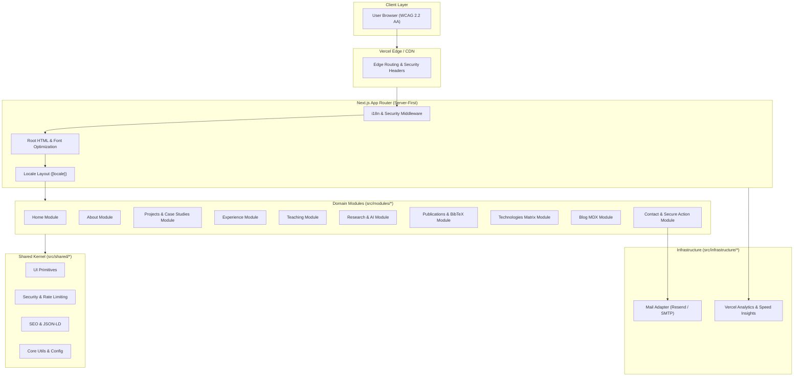

# Arquitetura de Software: Modular Monolith

## 1. Visão Geral e Paradigma
O sistema é estruturado como um **Monólito Modular (Modular Monolith)** executado sobre a infraestrutura serverless do **Next.js App Router** e hospedado no **Vercel Edge Network**.

### Por que Modular Monolith?
- **Zero Overhead Operacional:** Uma aplicação, um repositório, um pipeline de CI/CD e um único deployment sem a complexidade desnecessária de microsserviços.
- **Isolamento Rígido de Domínios:** Cada área de negócio/conhecimento (Projetos, Ensino, Pesquisa, Publicações, Blog, Contato) possui limites de contexto delimitados com dependências explicitamente controladas.
- **Evolução Sustentável:** Módulos podem evoluir internamente sem causar efeitos colaterais em outras partes do sistema.



## 2. Padrões de Implementação nos Módulos
Cada módulo em `src/modules/[module_name]` é organizado internamente da seguinte forma:

```
src/modules/[module_name]/
 ├── components/       # Componentes visuais exclusivos do domínio (RSC por padrão)
 ├── domain/           # Entidades, regras de negócio e interfaces
 ├── services/         # Consultas de dados e transformações
 ├── schemas/          # Schemas Zod de validação estrita
 ├── types/            # Tipagens TypeScript específicas
 ├── data/             # Conteúdo estático versionado e indexado
 ├── tests/            # Testes unitários e de componente do módulo
 └── index.ts          # Contrato público único do módulo
```

## 3. Server-First & Minimimal JavaScript Footprint
- O Next.js executa os componentes como **React Server Components (RSC)** por padrão.
- Diretivas `'use client'` são restritas aos componentes estritamente interativos (ex: alternador de tema/idioma, botões com feedback de cópia, drawer mobile e formulário interativo).
- Essa abordagem elimina centenas de kilobytes de bundles de hydration desnecessários, garantindo First Contentful Paint (FCP) e Largest Contentful Paint (LCP) ultra-rápidos.
